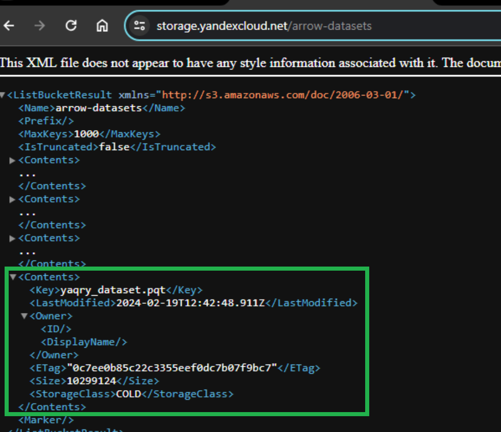
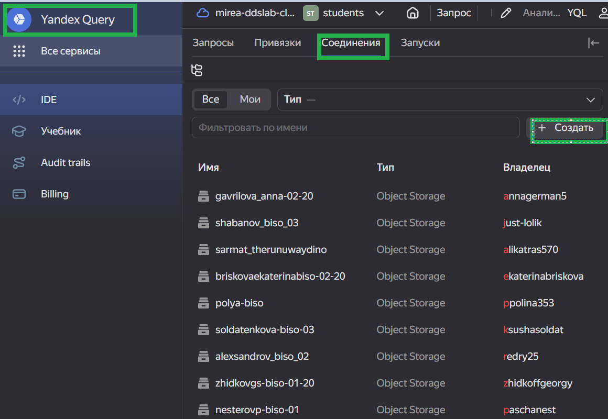
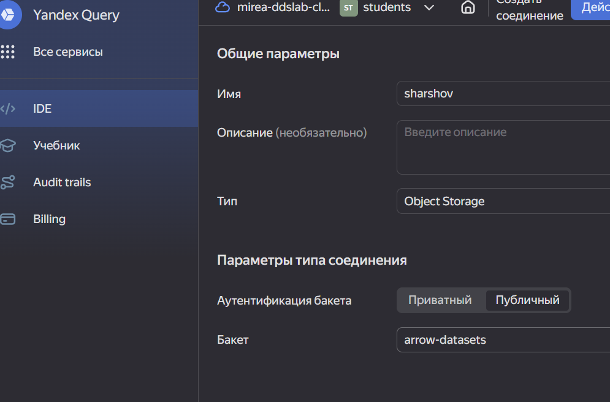
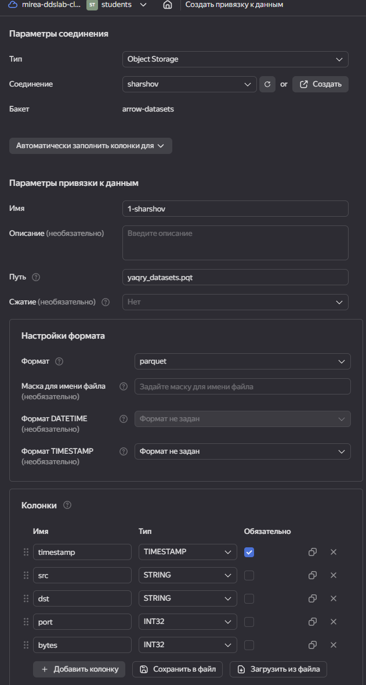
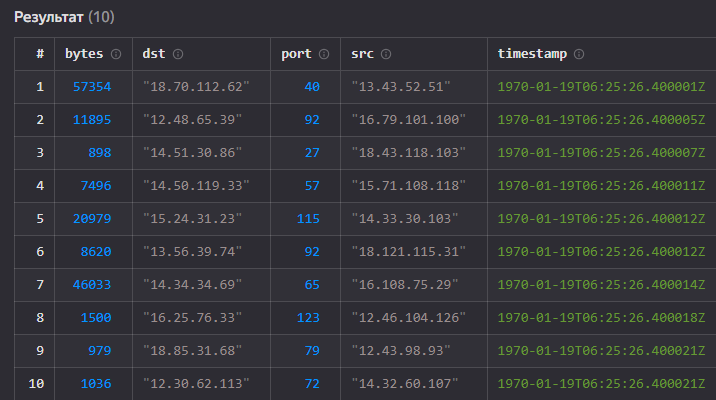
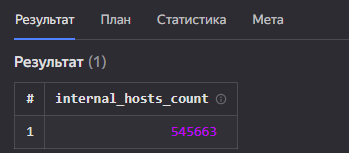
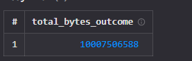
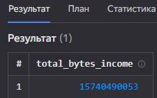

# lab1

Шаршов Иван

Лабораторная работа №1

## Цель

1.  Изучить возможности технологии Yandex Query для анализа структурированных наборов данных
2.  Получить навыки построения аналитического пайплайна для анализа данных с помощью сервисов Yandex Cloud
3.  Закрепить практические навыки использования SQL для анализа данных сетевой активности в сегментированной корпоративной сети

## Исходные данные

1.  ОС Windows 11
2.  RStudio Desktop
3.  Yandex Cloud: S3 Object Storage
4.  Yandex Cloud: Yandex Query
5.  Dataset: yaqry_dataset.pqt

## Описание работы

### Общая ситуация

Вам стали доступны данные сетевой активности в корпоративной сети компании XYZ. Данные хранятся в Yandex Object Storage. Проведите разведочный анализ данных и ответьте на вопросы.

### Задание

Используя сервис Yandex Query настроить доступ к данным, хранящимся в сервисе хранения данных Yandex Object Storage. При помощи соответствующих SQL запросов ответить на вопросы

## Ход работы

### Проверка доступности данных в Yandex Object Storage

Проверьте доступность данных (файл yaqry_dataset.pqt) в бакете arrow-datasets S3 хранилища Yandex Object Storage.

Для обращения к бакету и проверки доступности данных необходимо сформировать ссылку следующего вида: `https://storage.yandexcloud.net/bucket-name`.

```{=html}

```
В списке файлов есть файл датасета *yaqry_dataset.pqt* - он доступен по ссылке `https://storage.yandexcloud.net/arrow-datasets/yaqry_dataset.pqt`

### Подключение бакета как источника данных для Yandex Query

Перед проведением анализа нам надо связать Yandex Query с хранилищем наших данных. В нашем случае это S3 Object Storage от Yandex Cloud.

1.  Создать соединение для бакета в S3 хранилище

    

2.  Заполняем поля с учетом допустимых символов, выбираем тип аутентификации - публичный. Вводим имя бакета в соответствующее поле и сохраняем.

    

3.  Теперь, после создания соединения, укажем какой объект использовать в качестве источника данных. Для этого нужно сделать привязку данных.

    

4.  Проверка датасета

    

### Анализ

1.  Известно, что IP адреса внутренней сети начинаются с октетов, принадлежащих интервалу $$12-14$$. Определите количество хостов внутренней сети, представленных в датасете.

    

2\. Определите суммарный объем исходящего трафика



3\. Определите суммарный объем входящего трафикаОценка результата



В результате практической работы был проведен анализ сетевой активности с помощью SQL.

## Вывод

Мы получили навыки работы с Yandex Cloud с сервисом Yandex Query и языком структурированных зап
